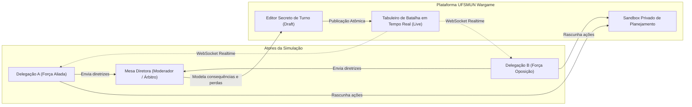
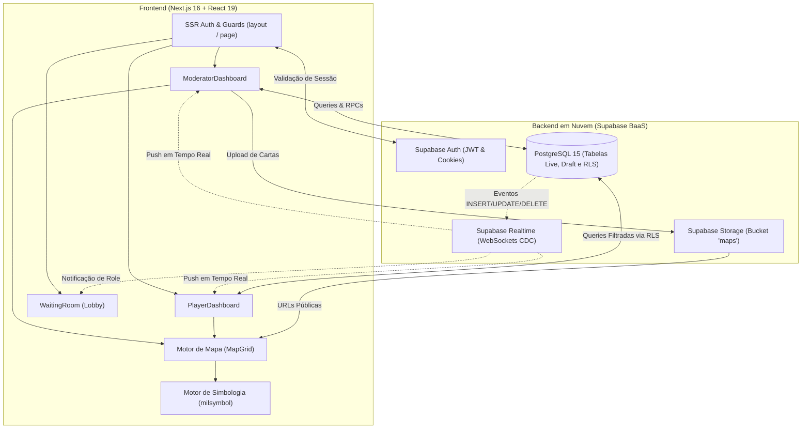
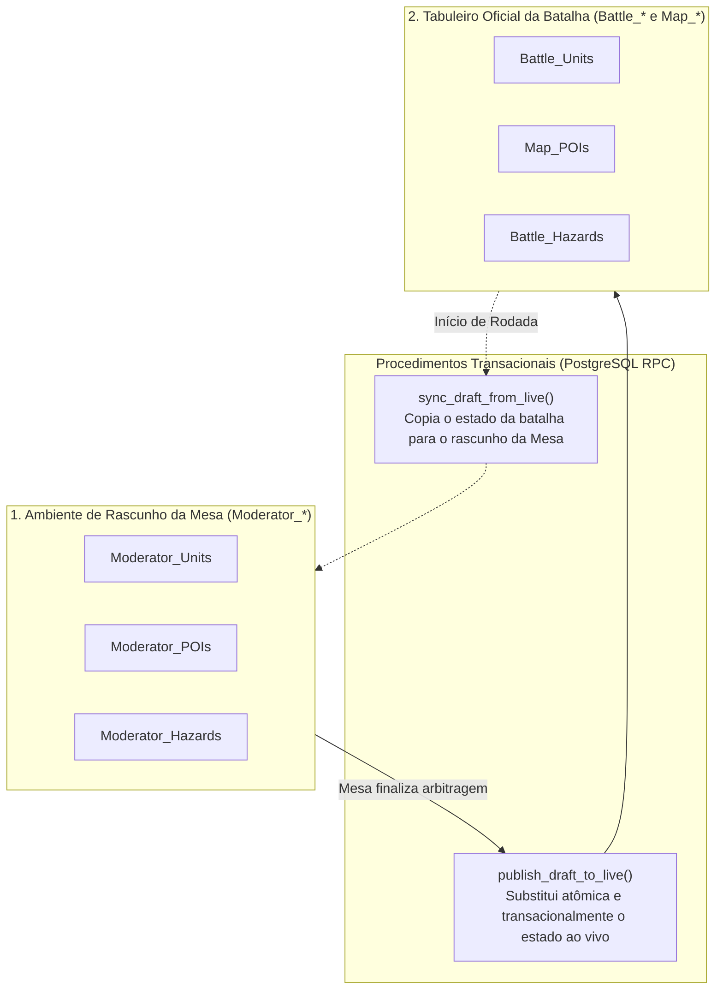
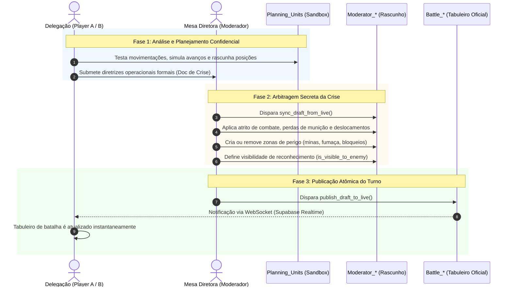

# ⚔️ Gabinete de Guerra UFSMUN — Tactical Simulation Platform

> **Plataforma web de simulação tática e operacional em tempo real para Comitês de Crise no Modelo das Nações Unidas da Universidade Federal de Santa Maria (UFSMUN).**

---

## 🧭 Sumário

1. [Visão Geral e Propósito](#-visão-geral-e-propósito)
2. [Arquitetura Geral do Sistema](#-arquitetura-geral-do-sistema)
3. [Perfis de Acesso e Segurança (RBAC & RLS)](#-perfis-de-acesso-e-segurança-rbac--rls)
4. [Módulos e Funcionalidades Principais](#-módulos-e-funcionalidades-principais)
   - [Motor Cartográfico Interativo (MapGrid)](#1-motor-cartográfico-interativo-mapgrid)
   - [Simbologia Militar Internacional NATO (APP-6 / MIL-STD-2525)](#2-simbologia-militar-internacional-nato-app-6--mil-std-2525)
   - [Pontos de Interesse Estratégicos (POIs)](#3-pontos-de-interesse-estratégicos-pois)
   - [Zonas de Operação e Riscos Táticos (Hazards)](#4-zonas-de-operação-e-riscos-táticos-hazards)
   - [Gerenciamento de Camadas Cartográficas (Layers)](#5-gerenciamento-de-camadas-cartográficas-layers)
   - [Bandeja de Reservas Estratégicas e Logística](#6-bandeja-de-reservas-estratégicas-e-logística)
   - [Sala de Espera (Lobby de Crise)](#7-sala-de-espera-lobby-de-crise)
5. [O Paradigma de Batalha: Draft vs. Live](#-o-paradigma-de-batalha-draft-vs-live)
6. [Ciclo de Operação de um Turno](#-ciclo-de-operação-de-um-turno)
7. [Identidade Visual e Design System](#-identidade-visual-e-design-system)
8. [Estrutura de Pastas do Projeto](#-estrutura-de-pastas-do-projeto)
9. [Tecnologias Utilizadas](#-tecnologias-utilizadas)
10. [Guia de Instalação e Execução Local](#-guia-de-instalação-e-execução-local)
11. [Roadmap de Evolução Técnica](#-roadmap-de-evolução-técnica)

---

## 🎯 Visão Geral e Propósito

O **Gabinete de Guerra UFSMUN** foi desenvolvido para transformar e modernizar a experiência de comitês de crise diplomático-militares em simulações acadêmicas da ONU. Inspirado em centros conjuntos de comando operacional (**Joint Operations Centers — JOC**), a ferramenta fornece uma interface interativa de alta fidelidade onde:

- **As Delegações (Jogadores / Gabinetes):** Operam suas forças, analisam cartas de situação, coordenam manobras e elaboram estratégias em um ambiente de planejamento isolado (*sandbox*), enquanto acompanham o teatro de operações sujeito à **Névoa de Guerra (*Fog of War*)**.
- **A Mesa Diretora (Moderadores):** Atua como árbitro supremo do conflito. A Mesa manipula o cenário em um ambiente confidencial de rascunho (*Draft*), insere eventos dinâmicos (bloqueios, campos minados, inteligência militar, baixas de combate) e publica o resultado do turno para o tabuleiro ao vivo (*Live*) de forma atômica e instantânea.



---

## 🏗️ Arquitetura Geral do Sistema

A plataforma utiliza uma arquitetura moderna orientada a eventos e renderização híbrida:

- **Frontend:** Desenvolvido em **Next.js 16 (App Router)** com **React 19**, **TypeScript** e estilizado com o novíssimo **Tailwind CSS v4**.
- **Backend & Banco de Dados (BaaS):** Apoiado no ecossistema **Supabase**, utilizando **PostgreSQL 15+** com políticas rigorosas de **Row Level Security (RLS)**, **Supabase Auth** baseado em sessões seguras com cookies (`@supabase/ssr`), **Supabase Realtime (CDC - Change Data Capture)** via WebSockets e **Supabase Storage** para hospedagem de cartas cartográficas.



---

## 🔐 Perfis de Acesso e Segurança (RBAC & RLS)

O sistema conta com Controle de Acesso Baseado em Papéis (**RBAC**), atrelado diretamente à tabela `public."Profiles"`:

| Papel (*Role*) | Descrição | Painel Acessado | Permissões no Sistema |
| :--- | :--- | :--- | :--- |
| **`Moderator`** | Membro da Mesa Diretora / Arbitragem | `ModeratorDashboard` | Controle total de criação, edição, movimentação de tropas e POIs, publicação de turnos, upload de camadas, criação de riscos e atribuição de papéis a usuários. |
| **`Player A`** | Delegação da Força Aliada / Azul | `PlayerDashboard` | Visualização do tabuleiro ao vivo (sujeito à Névoa de Guerra) e manipulação do seu próprio tabuleiro privado de planejamento (`Planning_Units`). |
| **`Player B`** | Delegação da Força Oposição / Vermelha | `PlayerDashboard` | Visualização do tabuleiro ao vivo (sujeito à Névoa de Guerra) e manipulação do seu próprio tabuleiro privado de planejamento (`Planning_Units`). |
| **`Unassigned`** | Usuário cadastrado aguardando atribuição | `WaitingRoom` | Acesso somente ao saguão/lobby com radar tático animado enquanto a mesa define sua delegação. |

### Garantia de Névoa de Guerra no Nível de Banco (RLS)
Diferente de sistemas que apenas ocultam dados no frontend via CSS ou JavaScript, o Gabinete de Guerra UFSMUN aplica **Row Level Security (RLS)** diretamente nas queries do PostgreSQL:

- Jogadores **não recebem** unidades inimigas que estejam com `is_visible_to_enemy = false`.
- Zonas operacionais só são enviadas pelo banco se a equipe estiver contida no array `visible_to_teams`.
- As tabelas de rascunho da mesa (`Moderator_*`) são totalmente inacessíveis para qualquer usuário que não possua `role = 'Moderator'`.

---

## ⚡ Módulos e Funcionalidades Principais

### 1. Motor Cartográfico Interativo (`MapGrid`)
O coração visual do simulador, construído para simular uma verdadeira mesa digital de operações táticas:
- **Navegação com Pan & Zoom:** Desenvolvido sobre `react-zoom-pan-pinch`, suporta arrasto suave pelo botão do meio ou modo dedicado de movimentação, aproximação com roda do mouse e centralização com ajuste automático à tela.
- **Grade Ortogonal Inteligente:** Malha quadriculada de $40\text{px} \times 40\text{px}$ com encaixe (*snap*) automático de coordenadas inteiras `(X, Y)`.
- **Invariância de Escala (`ScaleUpdater`):** Ao aproximar ou afastar o mapa, um hook dinâmico calcula o fator inverso do zoom e injeta na variável CSS `--unit-inverse-scale`. Isso garante que símbolos militares, ícones e textos não sofram distorções ou fiquem ilegíveis em nenhum nível de ampliação.
- **Barra de Ferramentas Flutuante (HUD):**
  - **Selecionar / Mover:** Inspeção de alvos e reposicionamento de fichas no grid.
  - **Arrastar Mapa:** Navegação livre sem perigo de deslocar unidades acidentalmente.
  - **Inserir Unidade:** Disparo de modal para criação de novas tropas militares.
  - **Desenhar Polígono / Zona:** Delimitação vetorial multiponto de setores de risco.
  - **Inserir Ponto Estratégico (POI):** Implantação de infraestruturas no grid.
  - **Controle Rápido de Opacidades:** Ajuste fino em tempo real da opacidade do mapa-base e da grade tática.

---

### 2. Simbologia Militar Internacional NATO (APP-6 / MIL-STD-2525)
A plataforma renderiza símbolos militares vetoriais dinâmicos em SVG através da biblioteca `milsymbol`, seguindo a padronização oficial da OTAN (SIDC de 15 caracteres):

```text
 ┌───────────────────────────────┐
 │     [ NATO APP-6 SYMBOL ]     │  <-- Renderizado dinamicamente via milsymbol
 ├───────────────────────────────┤
 │ 1ª Brigada de Infantaria Mec  │  <-- Nome da Unidade (Karla Bold)
 ├───────────────────────────────┤
 │ [████████░░] HP 80%           │  <-- Barra de Saúde (Verde / Âmbar / Vermelho)
 │ [██████████] MUNIÇÃO 100%     │  <-- Barra de Prontidão Logística
 └───────────────────────────────┘
```

- **Afiliação e Geometria Semântica:**
  - **Amigo / Player A:** Retângulo sólido em Verde Petróleo (`#2d7d74`) com contorno Menta (`#a4f1e5`).
  - **Inimigo / Player B:** Losango rotacionado em Ameixa Escura (`#4e1a3d`) com contorno Magenta (`#c03a6b`).
  - **Neutro:** Quadrado em Azul Ardósia (`#26265b`).
  - **Incógnito / Não Confirmado:** Trevo quadrifólio em Dourado Ocre (`#d4a017`).
- **Dimensões do Teatro Operacional:** Forças Terrestres, Aéreas, Navais de Superfície e Submarinas (com reponderação de área visual para manter uniformidade no grid).
- **Escalões Táticos:** De Pelotão (`E`), Companhia (`F`), Batalhão (`G`), Brigada (`H`) até Divisão (`I`).

---

### 3. Pontos de Interesse Estratégicos (POIs)
Permite a inserção de infraestruturas táticas no mapa, utilizando iconografia moderna (`lucide-react`) associada a estados de prontidão operacional:
- **Tipos Suportados:** Quartel-General (`Building2`), Base Militar (`Shield`), Aeródromo (`Plane`), Porto Marítimo (`Anchor`), Fábrica / Parque Industrial (`Factory`), Ponte Estratégica (`MoveHorizontal`), Depósito Logístico (`Warehouse`), Bunker Fortificado (`ShieldAlert`), Estação de Radar (`Radar`) e Posto Avançado (`Flag`).
- **Estados de Integridade:**
  - *Operacional:* Borda sólida e insígnia com as cores da facção controladora.
  - *Danificado:* Borda tracejada âmbar com eficácia reduzida.
  - *Destruído:* Fundo acinzentado com sobreposição de glifo vermelho `X`.
  - *Em Construção:* Borda pontilhada indicando obra em andamento.

---

### 4. Zonas de Operação e Riscos Táticos (Hazards)
Ferramenta para delimitação vetorial de polígonos sobre a carta tática, permitindo simular obstáculos físicos, geográficos ou eventos militares:
- **Tipos de Zonas:** Campos Minados, Bloqueios Navais, Zonas Inundadas / Rompimento de Barragens, Zonas Desmilitarizadas (DMZ), Redes de Trincheiras, Barragens de Artilharia, Contaminação Química/Biológica/Radiológica/Nuclear (CBRN/NRBQ), Cortinas de Fumaça e Zonas de Controle de Fogo.
- **Névoa de Guerra Customizável:** A Mesa Diretora define exatamente quais equipes (`visible_to_teams`) têm inteligência visual sobre a existência daquela zona.

---

### 5. Gerenciamento de Camadas Cartográficas (Layers)
- **Upload Direto para o Supabase Storage:** O moderador pode fazer upload de cartas topográficas históricas, fotografias aéreas ou imagens de satélite.
- **Profundidade e Z-Index:** Reordenação interativa de camadas com preservação de preferências no `localStorage` e sincronização no banco.
- **Ajuste de Transparência:** Sliders de opacidade independentes ($0\%\text{--}100\%$) para permitir sobreposição translúcida de cartas militares sobre o relevo.

---

### 6. Bandeja de Reservas Estratégicas e Logística
- **Gestão de Reforços:** Unidades marcadas como `in_reserve = true` são exibidas em uma bandeja flutuante inferior, fora do tabuleiro principal, prontas para serem mobilizadas.
- **Duplicação Rápida:** Atalho de teclado (`Ctrl+C`) e botão de clonagem para criar rapidamente unidades em série na reserva.
- **Vapores de Combate:** Cada unidade possui barras interativas de integridade:
  - **Saúde (HP):** $100\%$ a $75\%$ (Pronto para combate - Verde), $74\%$ a $35\%$ (Degradado - Âmbar), $34\%$ a $0\%$ (Crítico - Vermelho).
  - **Munição (Ammo):** Controle de prontidão logística para ressuprimento.

---

### 7. Sala de Espera (Lobby de Crise)
Os participantes recém-cadastrados entram em uma sala de recepção imersiva temática da UFSMUN:
- **Radar Tático Animado:** Varredura visual de radar com pulso de conexão ativa.
- **Briefing Institucional:** Cartões com instruções sobre conduta militar, disciplina de comunicações e protocolo de crise.
- **Sincronização Instantânea:** Quando a Mesa Diretora atribui uma facção ao usuário na aba de gestão, a tela do jogador atualiza automaticamente sem necessidade de F5 manual.

---

## 🔄 O Paradigma de Batalha: Draft vs. Live

Para evitar que os jogadores visualizem testes ou ajustes parciais da Mesa Diretora durante a resolução de um turno, o banco de dados implementa uma cisão arquitetural estrita entre **Rascunho** e **Ambiente ao Vivo**:



- **`publish_draft_to_live()`:** Procedimento armazenado que limpa as tabelas ao vivo e insere os registros das tabelas de rascunho em uma **única transação atômica** (`BEGIN ... COMMIT`).
- **`sync_draft_from_live()`:** Permite que a Mesa puxe o estado atual publicado de volta para a sua prancheta de rascunho para começar a trabalhar no próximo turno a partir do cenário vigente.

---

## ⏱️ Ciclo de Operação de um Turno

Um turno típico de simulação no Gabinete de Guerra UFSMUN segue as etapas abaixo:



---

## 🎨 Identidade Visual e Design System

O Gabinete de Guerra UFSMUN utiliza um sistema de design proprietário detalhado em [`design.md`](file:///c:/Users/vkunz/OneDrive/Documentos/Wargamming/design.md), combinando a seriedade de centros de comando com o visual analógico de dossiês militares:

### Paleta Semântica de Cores

| Token CSS | Hex | Função Semântica |
| :--- | :--- | :--- |
| `--color-surface-canvas-void` | `#1f2420` | Fundo principal da mesa digital de operações (carvão militar profundo). |
| `--color-surface-parchment` | `#f7f4eb` | Painéis flutuantes, gavetas de dossiê e modais (pergaminho tático impresso). |
| `--color-surface-parchment-dim` | `#ede9dd` | Divisores, bordas de cartões e fundos secundários de controle. |
| `--color-primary` / `--color-primary-container` | `#00322b` / `#004b41` | Verde institucional UFSMUN na barra de comando e cabeçalhos de modais. |
| `--color-faction-friendly` | `#2d7d74` / `#a4f1e5` | Força Aliada / Player A (Verde Petróleo com destaque Menta). |
| `--color-faction-hostile` | `#4e1a3d` / `#c03a6b` | Força Oposição / Player B (Ameixa Escura com destaque Magenta). |
| `--color-faction-neutral` | `#26265b` | Instalações e forças não-alinhadas ou cívicas (Azul Ardósia). |
| `--color-faction-unknown` | `#d4a017` / `#ffdfa0` | Contatos de reconhecimento não confirmados (Dourado Ocre). |

### Tipografia
- **Títulos, Botões e Categorias:** **Montserrat** (`700`/`600`), conferindo autoridade institucional militar.
- **Corpo de Texto, Coordenadas e Vapores de Combate:** **Karla**, garantindo leitura nítida e sem ambiguidades sob pressão de crise.
- **Ícones do Sistema:** Google `Material Symbols Outlined` (navegação) e `Lucide React` (marcos de terreno e botões operacionais).

---

## 📂 Estrutura de Pastas do Projeto

```text
Wargamming/
├── README.md                          # Documentação completa da plataforma
├── design.md                          # Especificação detalhada de UI/UX e Design System
├── schema.md                          # Modelagem de dados, arquitetura e RLS
├── wargame-client/                    # Aplicação Web (Next.js 16)
│   ├── public/                        # Ativos estáticos e logotipos UFSMUN
│   ├── src/
│   │   ├── app/                       # Rotas e páginas (Next.js App Router)
│   │   │   ├── auth/callback/route.ts # Callback para autenticação do Supabase
│   │   │   ├── login/page.tsx         # Página de login operacional
│   │   │   ├── register/page.tsx      # Cadastro de novos delegados
│   │   │   ├── globals.css            # Tokens de tema e CSS customizado (Tailwind v4)
│   │   │   ├── layout.tsx             # Root layout com importação de fontes e metadados
│   │   │   └── page.tsx               # Roteador central baseado no perfil do usuário
│   │   ├── components/                # Componentes da interface operacional
│   │   │   ├── ui/
│   │   │   │   ├── TopBar.tsx         # Barra superior fixa de comando e status
│   │   │   │   └── Panel.tsx          # Contêiner base com estilo pergaminho tático
│   │   │   ├── BottomNavbar.tsx       # Barra de navegação tática para mobile e tablets
│   │   │   ├── HazardCreationModal.tsx# Modal de parametrização e desenho de zonas
│   │   │   ├── HazardPanel.tsx        # Inspetor e editor de zonas operacionais
│   │   │   ├── LayerManager.tsx       # Gerenciador de camadas raster e upload de mapas
│   │   │   ├── MapGrid.tsx            # Motor cartográfico com grid tático e zoom/pan
│   │   │   ├── ModeratorDashboard.tsx # Painel mestre da Mesa Diretora
│   │   │   ├── NatoSymbol.tsx         # Renderizador dinâmico de símbolos MIL-STD-2525
│   │   │   ├── PlayerDashboard.tsx    # Painel dos Jogadores (Planejamento e Batalha)
│   │   │   ├── PoiBadge.tsx           # Insígnia gráfica de infraestrutura e status
│   │   │   ├── PoiCreationModal.tsx   # Modal de criação de pontos de interesse
│   │   │   ├── PoiPanel.tsx           # Inspetor e editor de POIs
│   │   │   ├── ReservesPanel.tsx      # Gaveta de unidades em reserva estratégica
│   │   │   ├── RightPanelDossier.tsx  # Dossiê de inteligência e edição de unidades
│   │   │   ├── Sidebar.tsx            # Barra lateral de controle de camadas e filtros
│   │   │   ├── TeamAssignment.tsx     # Gerenciamento de delegações e nomes de facções
│   │   │   ├── UnitCreationModal.tsx  # Modal de criação de unidades militares NATO
│   │   │   ├── UnitPanel.tsx          # Roster de forças e editor de atributos
│   │   │   └── WaitingRoom.tsx        # Sala de espera imersiva com radar animado
│   │   ├── hooks/
│   │   │   └── useResizablePanel.ts   # Hook para painéis com redimensionamento lateral
│   │   ├── lib/
│   │   │   ├── milsymbol/             # Utilitários de codificação SIDC e tabelas NATO
│   │   │   ├── supabaseClient.ts      # Cliente Supabase singleton para o navegador
│   │   │   └── supabaseServer.ts      # Cliente seguro Supabase para Server Components
│   │   └── data/
│   │       └── mapConfig.json         # Configuração geométrica do mapa padrão
│   ├── supabase/                      # Scripts SQL para migração e banco de dados
│   │   ├── supabase_schema.sql        # Esquema inicial DDL e funções principais
│   │   ├── supabase_rls_policies.sql  # Políticas de Row Level Security (Névoa de Guerra)
│   │   ├── supabase_moderator_draft.sql# Tabelas de rascunho da mesa e RPCs
│   │   ├── supabase_add_fuel_ammo.sql # Migração com adições de munição e integridade
│   │   └── supabase_storage.sql       # Configuração de buckets e permissões do Storage
│   ├── package.json                   # Dependências e scripts do projeto
│   └── tsconfig.json                  # Configuração do TypeScript
```

---

## 🛠️ Tecnologias Utilizadas

| Tecnologia | Versão | Função no Ecossistema |
| :--- | :--- | :--- |
| **Next.js** | `16.3.5` | Framework web React com suporte a App Router, SSR e Server Actions. |
| **React** | `19.2.8` | Biblioteca de componentes de interface reativa. |
| **TypeScript** | `^5` | Tipagem estática e segurança de código. |
| **Tailwind CSS** | `^4` | Motor de estilização atômica através de design tokens em `@theme`. |
| **Supabase JS** | `^2.116.0` | Cliente oficial para integração com PostgreSQL, Realtime e Storage. |
| **Supabase SSR** | `^0.12.7` | Gerenciamento de autenticação em Server Components via cookies HTTP. |
| **milsymbol** | `^3.0.4` | Biblioteca de geração vetorial de simbologia militar internacional NATO. |
| **react-zoom-pan-pinch** | `^4.2.0` | Motor de navegação fluida, zoom por gesto/roda e pan do tabuleiro. |
| **Lucide React** | `^1.45.0` | Ícones de alta fidelidade para infraestrutura, POIs e ações de HUD. |
| **@dnd-kit** | `^6.3.1` | Primitivas de drag-and-drop para reordenação de camadas e manobra de fichas. |

---

## 🚀 Guia de Instalação e Execução Local

### Pré-requisitos
- **Node.js**: Versão 20.x ou superior recomendada.
- **npm** ou gerenciador de pacotes equivalente (pnpm, yarn).
- **Conta no Supabase**: Um projeto criado em [supabase.com](https://supabase.com).

---

### Passo 1: Clonar o Repositório
```bash
git clone https://github.com/vitorkunz/Wargamming.git
cd Wargamming/wargame-client
```

---

### Passo 2: Instalar as Dependências
```bash
npm install
```

---

### Passo 3: Configurar o Banco de Dados no Supabase
Acesse o **SQL Editor** do seu projeto no Supabase e execute os scripts da pasta `supabase/` na seguinte ordem sequencial:

1. **`supabase_schema.sql`**: Cria as tabelas básicas (`Profiles`, `Game_State`, `Battle_Units`, `Planning_Units`, `Map_POIs`, `Battle_Hazards`, `Map_Layers`) e a trigger de novos usuários.
2. **`supabase_moderator_draft.sql`**: Cria as tabelas de rascunho da Mesa Diretora (`Moderator_Units`, `Moderator_POIs`, `Moderator_Hazards`) e os procedimentos `publish_draft_to_live()` e `sync_draft_from_live()`.
3. **`supabase_add_fuel_ammo.sql`**: Adiciona a coluna de controle logístico `ammo` e atualiza as RPCs.
4. **`supabase_rls_policies.sql`**: Configura as políticas restritivas de Row Level Security garantindo a Névoa de Guerra.
5. **`supabase_storage.sql`**: Cria o bucket público `maps` e define as permissões de upload exclusivas para Moderadores.

> 💡 **Habilitar Realtime:** No painel do Supabase, acesse **Database -> Replication** e certifique-se de que a replicação Realtime está ativada para as tabelas `Profiles`, `Battle_Units`, `Planning_Units`, `Map_POIs`, `Battle_Hazards` e `Game_State`.

---

### Passo 4: Configurar as Variáveis de Ambiente
Crie um arquivo `.env.local` na pasta `wargame-client/`:

```env
NEXT_PUBLIC_SUPABASE_URL=https://seu-projeto.supabase.co
NEXT_PUBLIC_SUPABASE_ANON_KEY=sua-chave-publica-anon
```

---

### Passo 5: Iniciar o Servidor de Desenvolvimento
```bash
npm run dev
```

Abra seu navegador em [http://localhost:3000](http://localhost:3000).

---

### Passo 6: Promover o Primeiro Usuário a Moderador
1. Cadastre-se na aplicação via `/register`.
2. Como padrão, você começará na **Sala de Espera** (`role = 'Unassigned'`).
3. Vá ao **Table Editor** do Supabase, abra a tabela `Profiles`, localize seu usuário e altere o campo `role` de `'Unassigned'` para `'Moderator'`.
4. Ao recarregar a aplicação, o painel completo da Mesa Diretora será desbloqueado, permitindo atribuir os demais delegados a partir da própria interface!

---

## 🔮 Roadmap de Evolução Técnica

- [ ] **Vetores de Manobra Tática:** Ferramenta gráfica para traçar setas de avanço, eixos de ataque e linhas de fase militares sobre a carta.
- [ ] **Histórico e Replay de Turnos:** Gravação de snapshots de cada turno publicado, permitindo reprodução sequencial da evolução da crise em assembleia.
- [ ] **Assistente de Resolução de Combate:** Calculadora paramétrica com tabelas de atrito baseadas em tipo de terreno e armamentos para auxiliar a Mesa.
- [ ] **Geração de SITREPs em PDF:** Exportação automática de relatórios de situação e mapas do teatro operacional com estatísticas de baixas.

---

## 👥 Realização e Créditos

Desenvolvido para o **UFSMUN (Universidade Federal de Santa Maria Model United Nations)**.
Inspirado na excelência acadêmica e nas simulações de crise da UFSM.
