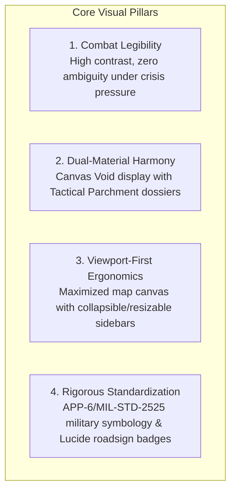
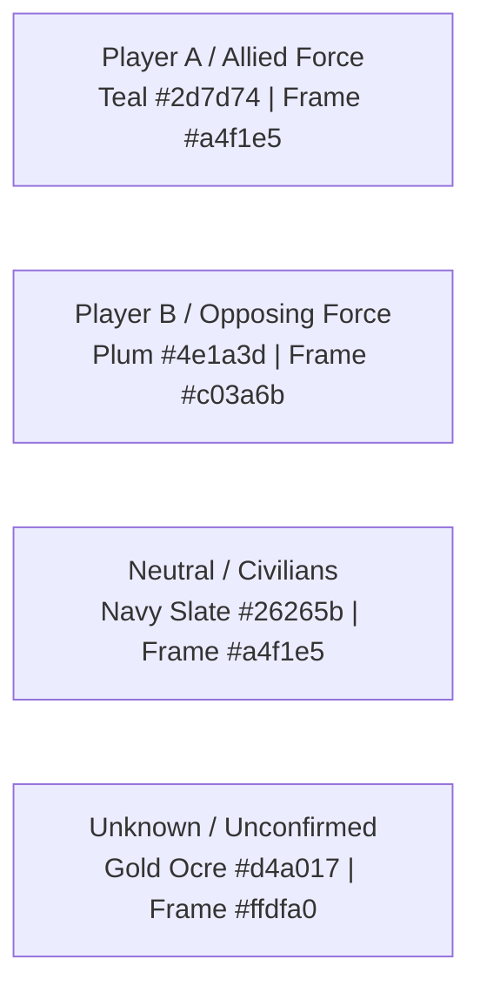
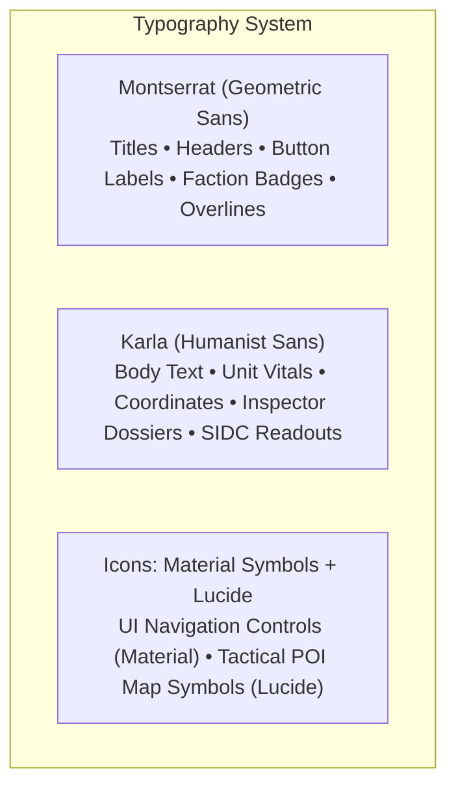
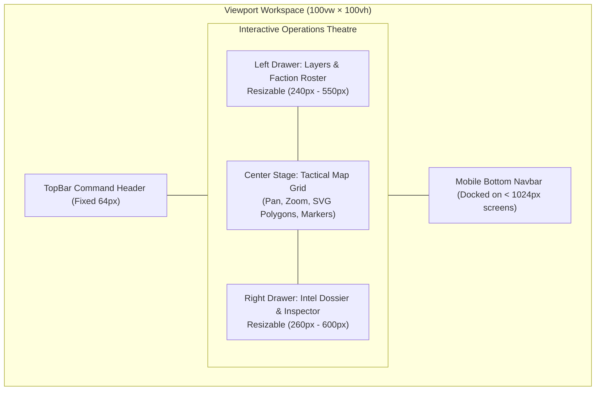
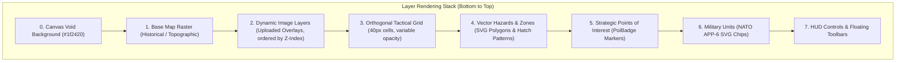
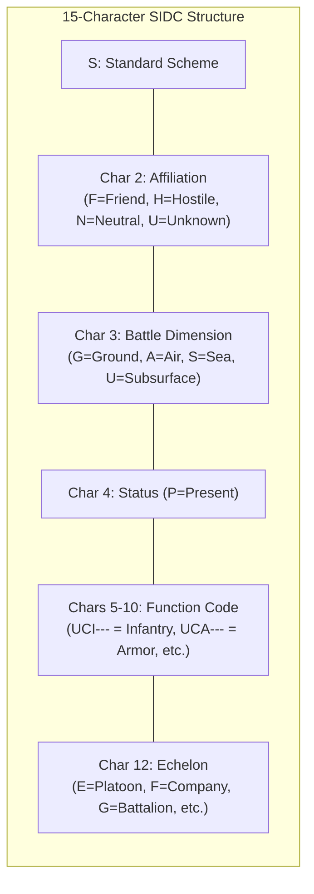

# Visual Design & UI/UX System Specification (`design.md`)
## Project: UFSMUN War Cabinet Tactical Simulation Platform

---

## 1. Executive Summary & Design Philosophy

The **UFSMUN War Cabinet Tactical Simulation Platform** is a web-based operational command interface designed to simulate the high-stakes environment of a modern military and diplomatic Joint Operations Center (JOC) for Model United Nations (MUN) Crisis Committees.

The UI/UX architecture bridges two distinct visual metaphors:
1. **The Electronic War Room Display (*Canvas Void*):** A dark, tactical canvas optimized for low eye fatigue during hours of continuous operation, utilizing deep charcoal-greens, glowing telemetry accents, and crisp vector cartography.
2. **The Field Commander's Dossier (*Tactical Parchment*):** Floating drawers, inspector panels, and modal dialogs styled in warm off-white parchment, reminiscent of declassified military briefing dossiers, printed topographic charts, and field manuals.



### Core Design Goals
- **Immediate Faction Disambiguation:** Instantaneous visual differentiation between Friendly, Hostile, Neutral, and Unconfirmed forces using color coding and geometric framing.
- **Scale Invariance:** Markers, symbology, and badges remain legible and visually balanced regardless of map pan, tilt, or zoom level.
- **Cognitive Load Minimization:** Complex battle telemetry (health, ammo, echelon, coordinates, operational status) is condensed into intuitive micro-gauges and clean badges.
- **Adaptive Screen Real Estate:** Dynamic resizable splitters allow operators to tailor sidebar widths to their display resolution or collapse them entirely for an uninterrupted tactical overview.

---

## 2. Design Tokens & Color Palette

All color tokens are defined as first-class CSS custom variables within `@theme` in [`globals.css`](file:///c:/Users/vkunz/OneDrive/Documentos/Wargamming/wargame-client/src/app/globals.css) and exposed through Tailwind CSS v4 utility classes.

### 2.1. Surfaces & Backgrounds

| Token | Hex Value | Semantic Role |
| :--- | :--- | :--- |
| `--color-surface-canvas-void` | `#1f2420` | **Primary Canvas Background.** Deep military forest-charcoal representing the digital map display table. |
| `--color-surface-parchment` | `#f7f4eb` | **Inspector Panels & Modals.** Warm paper parchment emulating physical field maps and situation dossiers. |
| `--color-surface-parchment-dim`| `#ede9dd` | Secondary parchment container, card borders, and segmented control backgrounds. |
| `--color-surface-card` | `#ffffff` | Clean white foreground for inputs, active tab indicators, and nested card components. |
| `--color-primary` | `#00322b` | **Institutional Dark Emerald.** TopBar brand bar and modal headers. |
| `--color-primary-container` | `#004b41` | Elevated command chrome, navigation containers, and focused buttons. |

### 2.2. Faction Identity Colors

The simulation features strict color assignments for participating delegations, aligned with tactical military cartography and custom high-contrast enhancements:



| Faction / Alignment | Primary Fill | Accent / Frame | Contrast Foreground | Thematic Identity |
| :--- | :--- | :--- | :--- | :--- |
| **Player A (Allied Force)** | `#2d7d74` | `#a4f1e5` | `#ffffff` | Oceanic deep teal with luminous mint highlights. |
| **Player B (Opposing Force)**| `#4e1a3d` | `#c03a6b` | `#ffffff` | Dark plum-wine with vibrant magenta accents. |
| **Neutral Asset** | `#26265b` | `#a4f1e5` | `#ffffff` | Deep navy-slate representing non-aligned infrastructure. |
| **Unknown / Reconnaissance** | `#d4a017` | `#ffdfa0` | `#ffffff` | Tactical goldenrod ocre representing unverified contacts. |

### 2.3. Operational Status & Hazards

| State / Hazard | Hex Value | Border / Styling | Semantic Application |
| :--- | :--- | :--- | :--- |
| **Selection Pulse** | `#22d3ee` | Continuous Cyan Ring | Highlighted unit, POI, or active drawing vertex. |
| **Critical / Destroyed** | `#c03a6b` / `#ef4444`| Grayscale + Red `X` | Destroyed asset or fatal casualty threshold. |
| **Degraded / Damaged** | `#e07a2f` | Dashed Amber Border | Equipment with compromised combat effectiveness. |
| **Minefield Hazard** | `#ef4444` | Red Striped Polygon | Lethal anti-personnel/vehicle hazard zone. |
| **Naval Blockade** | `#a855f7` | Violet Hatch Polygon | Maritime exclusion and interdiction sector. |
| **Flooded / Water Hazard**| `#3b82f6` | Translucent Azure Fill | Impassable marshlands or breached dam zones. |
| **Demilitarized Zone (DMZ)**| `#6b7280`| Neutral Gray Dashed Line| Treaty-restricted buffer corridor. |
| **Chemical / CBRN Zone** | `#16a34a` | Toxic Olive Green Fill | Contaminated zone requiring protective gear. |

---

## 3. Typography & Hierarchy

The application employs a dual-typeface strategy engineered to balance military command authority with dense data readout legibility.



### 3.1. Type Hierarchy

| Classification | Font Family | Size / Leading | Weight / Tracking | Usage |
| :--- | :--- | :--- | :--- | :--- |
| **Headline Large** | `Montserrat` | `24px` / `1.2` | Bold (`700`) / `tracking-wide` | Modal titles, crisis scenario headings. |
| **Headline Small** | `Montserrat` | `18px` / `1.3` | Bold (`700`) / `tracking-normal` | Panel section titles, unit dossier names. |
| **Label Medium** | `Montserrat` | `13px` / `1.2` | SemiBold (`600`) / `tracking-wider` | TopBar navigation pills, buttons, HUD tooltips. |
| **Tag / Overline** | `Montserrat` | `10px` / `1.1` | Bold (`700`) / `uppercase tracking-widest` | Category dividers, echelon badges, role pills. |
| **Body Base** | `Karla` | `14px` / `1.5` | Regular (`400`) / `tracking-normal` | Intel briefings, situation reports, notes. |
| **Data / Telemetry** | `Karla` | `12px` / `1.2` | Bold (`700`) / `tabular-nums` | Grid coordinates `(X, Y)`, health %, ammo %. |

### 3.2. Iconography

1. **System Navigation (Google Material Symbols Outlined):**
   - Size: `18px` to `24px`, stroke weight `400`.
   - Used for application controls: Zoom (`add`, `remove`), Pan (`pan_tool`), Select (`near_me`), Layers (`layers`), Profiles (`person`), and Fullscreen (`fullscreen`).
2. **Tactical Infrastructure Badges (Lucide React):**
   - Size: `16px` to `24px`, stroke width `2px`.
   - Integrated into [`PoiBadge.tsx`](file:///c:/Users/vkunz/OneDrive/Documentos/Wargamming/wargame-client/src/components/PoiBadge.tsx): Military Base (`Shield`), HQ (`Building2`), Airfield (`Plane`), Port (`Anchor`), Factory (`Factory`), Bridge (`MoveHorizontal`), Depot (`Warehouse`), Bunker (`ShieldAlert`), Radar (`Radar`), Outpost (`Flag`).

---

## 4. Layout Architecture & Workspace Ergonomics

The application utilizes a viewport-locked layout (`100vw` $\times$ `100vh`, `overflow: hidden`) with a global zoom preset of `0.8` on desktop, maximizing spatial information density.



### 4.1. The Three-Column Layout

1. **TopBar Command Header ([`TopBar.tsx`](file:///c:/Users/vkunz/OneDrive/Documentos/Wargamming/wargame-client/src/components/ui/TopBar.tsx)):**
   - Height: `64px` (expands to `104px` on stacked mobile views).
   - Visual Treatment: Deep emerald `#004b41` backdrop with subtle bottom border and backdrop blur.
   - Left Zone: UFSMUN official emblem, crisis room branding, and committee sub-heading.
   - Center Zone: Segmented pill navigation (`Gerir Usuários` / `Editar Mapa` / `Ver Mapa Publicado` or `Planejamento` / `Batalha`).
   - Right Zone: User profile pill with role badge and sign-out action.

2. **Left Panel: Cartographic Layers & Order ([`Sidebar.tsx`](file:///c:/Users/vkunz/OneDrive/Documentos/Wargamming/wargame-client/src/components/Sidebar.tsx)):**
   - Houses the layer stack: Base Map, Tactical Grid, Dynamic Image Overlays, Unit Visibility, and Hazard Overlays.
   - Includes real-time troop counts per faction with colored badges.
   - Layer reordering handles with drag-and-drop elevation ordering.
   - Independent opacity sliders ($0\text{--}100\%$) for every raster overlay.

3. **Center Canvas: The Tactical Map Surface ([`MapGrid.tsx`](file:///c:/Users/vkunz/OneDrive/Documentos/Wargamming/wargame-client/src/components/MapGrid.tsx)):**
   - The central war table, displaying uploaded raster maps, orthogonal coordinate lines, vector hazard zones, NATO symbology chips, and POI markers.
   - Floats the top HUD tool bar and bottom viewport controls.

4. **Right Panel: Intel Dossier & Inspector ([`UnitPanel.tsx`](file:///c:/Users/vkunz/OneDrive/Documentos/Wargamming/wargame-client/src/components/UnitPanel.tsx) / [`RightPanelDossier.tsx`](file:///c:/Users/vkunz/OneDrive/Documentos/Wargamming/wargame-client/src/components/RightPanelDossier.tsx)):**
   - Dual-tab interface: **Roster** (searchable, filterable list of all forces) and **Details** (tactical dossier of the selected entity).
   - Features editable unit vitals (Health and Ammunition sliders), military SIDC breakdown, notes, and deletion/cloning triggers.

### 4.2. Interactive Resizable Panels ([`useResizablePanel.ts`](file:///c:/Users/vkunz/OneDrive/Documentos/Wargamming/wargame-client/src/hooks/useResizablePanel.ts))
Both sidebars feature a custom drag handle along their inner edge:
- **Visual Feedback:** A subtle 4px grab line that highlights with a cyan border (`#22d3ee`) when hovered or actively dragged.
- **Constraints:** Left panel clamps between `240px` and `550px`; Right panel clamps between `260px` and `600px`.
- **State Persistence:** Widths are automatically synchronized with `localStorage` keys (`wargame_left_sidebar_width`, `wargame_right_sidebar_width`), restoring custom layouts upon page refresh.
- **Collapsibility:** Floating restore buttons appear on the viewport edges when panels are closed, allowing instant one-click expansion.

---

## 5. Tactical Canvas & Map Visualization Engine

The tactical canvas is the focal point of the application, rendering layered geographic and combat data.



### 5.1. Coordinate System & Grid Geometry
- **Cell Size:** Uniform square cell dimensions of $40\text{px} \times 40\text{px}$ (`CELL_SIZE = 40`).
- **Snapping:** Unit movements and POI placements snap to integer grid coordinates $(x, y)$ calculated from the transform wrapper offset.
- **Grid Styling:** Crisp hairline grid borders rendered in high-contrast semi-transparent white/parchment with real-time opacity modulation ($0.0$ to $1.0$).

### 5.2. Zoom Compensation & Scale Normalization Engine
When operators zoom into specific tactical sectors, standard SVG markers risk becoming overwhelmingly large or disproportionately pixelated.
- **The `ScaleUpdater` Technique:**
  An active listener hooks into `useTransformEffect` from `react-zoom-pan-pinch`:
  $$\text{Scale Factor} = \begin{cases} \frac{1}{\text{current\_zoom}}, & \text{if } \text{current\_zoom} > 1.0 \\ 1.0, & \text{otherwise} \end{cases}$$
  This ratio is continuously injected into the root DOM as CSS custom property `--unit-inverse-scale`.
- **CSS Application:** Markers and NATO symbols scale by `calc(var(--unit-inverse-scale, 1))`, maintaining ideal visual density and physical footprint across all zoom levels.

### 5.3. Floating HUD Control System
Floating glassmorphism toolbars hover above the map:
- **Top HUD Bar:**
  - *Select / Move* (`near_me`): Interacts with markers and drags units.
  - *Pan Map* (`pan_tool`): Freehand canvas navigation.
  - *Place Unit* (`add_location_alt`): Modal spawn trigger at selected tile.
  - *Draw Zone* (`polyline`): Interactive vertex-by-vertex polygon creation.
  - *Strategic POI* (`flag`): Drops strategic infrastructure at grid point.
- **Bottom HUD Bar:**
  - Zoom In / Zoom Out (`+` / `-`).
  - Fit to Screen (`center_focus_strong`).
  - Fullscreen Toggle (`fullscreen`).
  - Layer Opacities Menu: Dropdown menu with live sliders for Base Map and Grid opacity.

---

## 6. Military Symbology & Tactical Entity Design

### 6.1. NATO APP-6 / MIL-STD-2525 Symbology Engine

The platform integrates standard NATO military symbology rendered dynamically via `milsymbol` into lightweight Base64 SVG data URLs.



#### Visual Geometry by Affiliation
- **Friendly (Player A):** Solid rectangle frame with Teal fill (`#2d7d74`) and Mint accent border (`#a4f1e5`).
- **Hostile (Player B):** Rotated diamond frame with Plum fill (`#4e1a3d`) and Magenta accent border (`#c03a6b`).
- **Neutral:** Square frame with Navy-Slate fill (`#26265b`).
- **Unknown:** Quatrefoil (cloud-shaped) frame with Gold fill (`#d4a017`).

#### Dimension Weight Normalization
Air (`A`), Sea Surface (`S`), and Subsurface (`U`) symbol frames possess inherently larger bounding boxes in the MIL-STD-2525 standard. The engine programmatically scales these down to `75%` (`size * 0.75`) relative to Ground frames, ensuring harmonious visual weight on the battle grid.

### 6.2. Unit Chip Anatomy

Each unit on the map grid is rendered as a composite tactical chip:

```text
┌───────────────────────────────┐
│     [ NATO APP-6 SYMBOL ]     │  <-- Dynamic SVG (milsymbol)
├───────────────────────────────┤
│ 1st Mech Inf Bde              │  <-- Unit Name (Karla Bold, 11px)
├───────────────────────────────┤
│ [████████░░] HP 80%           │  <-- Health Gauge (Green/Orange/Red)
│ [██████████] AMMO 100%        │  <-- Ammo Gauge (Cyan/Slate)
└───────────────────────────────┘
```

- **Active Selection Glow:** Selected units display a bright cyan pulsing ring (`box-shadow: 0 0 0 3px #22d3ee`).
- **Fog of War Masking:** Hostile or unconfirmed units that have not been spotted display at $40\%$ opacity with a desaturated border.
- **Reserve Units:** Displayed in a horizontal parchment tray ([`ReservesPanel.tsx`](file:///c:/Users/vkunz/OneDrive/Documentos/Wargamming/wargame-client/src/components/ReservesPanel.tsx)) with drag handles for deployment onto the map.

### 6.3. Strategic Points of Interest (POIs)

Rendered as stylized shield/circle badges with clear roadsign-style iconography:
- **Operational:** Solid faction background, crisp border.
- **Damaged:** Dashed border in bright amber (`#f59e0b`), $80\%$ opacity.
- **Destroyed:** Desaturated slate background (`#0f172a`), darkened border, overlaid with a prominent red diagonal `X` glyph (`#ef4444`).
- **Under Construction:** Dotted pulsing border.

### 6.4. Operational Hazard Zones (Polygons)

Polygons rendered via SVG overlays directly over the grid:
- **Vertices:** Circular anchor points with hover tooltips and drag handles during edit mode.
- **Fills:** Semi-transparent thematic tints ($20\%\text{--}35\%$ alpha) with SVG pattern definitions (diagonal danger stripes for minefields, wave ripples for blockades).
- **Labels:** Centered high-contrast badge displaying the zone label (e.g., `ZONA MINADA SETOR NORTE`) rendered in uppercase bold `Montserrat`.

---

## 7. Component Anatomy & UI Patterns

### 7.1. Intel Dossier Inspector ([`UnitPanel.tsx`](file:///c:/Users/vkunz/OneDrive/Documentos/Wargamming/wargame-client/src/components/UnitPanel.tsx))
The right drawer provides full telemetry for the selected entity:
1. **Header:** SIDC symbol preview, editable unit name input, and quick-action buttons (Close, Duplicate to Reserves, Delete).
2. **Combat Vitals Section:**
   - **Health (HP):** Interactive numerical input and range slider with color transitions:
     - $75\%\text{--}100\%$: Combat Effective (Emerald Green).
     - $35\%\text{--}74\%$: Degraded (Amber Orange).
     - $0\%\text{--}34\%$: Critical (Crimson Red).
   - **Ammunition (AMMO):** Logistics gauge tracking resupply needs.
3. **Command & Classification:**
   - Dropdown selectors for Affiliation, Tactical Dimension, Function Category, and Echelon.
4. **Visibility & Intel Controls:**
   - Toggle switch for `Visible to Enemy` (Fog of War override).
5. **Situation Notes:**
   - Textarea for intelligence briefings, commander's intent, and battle casualties.

### 7.2. Creation Modals ([`UnitCreationModal.tsx`](file:///c:/Users/vkunz/OneDrive/Documentos/Wargamming/wargame-client/src/components/UnitCreationModal.tsx) / [`HazardCreationModal.tsx`](file:///c:/Users/vkunz/OneDrive/Documentos/Wargamming/wargame-client/src/components/HazardCreationModal.tsx))
- **Backdrop:** Dark translucent scrim (`rgba(0,0,0,0.6)`) with `backdrop-blur-sm`.
- **Card:** Rounded rectangular parchment dialog (`#f7f4eb`) with deep emerald header.
- **Category Grids:** Multi-column selectable cards with visual previews (e.g., clicking on "Blindados" updates the live NATO symbol preview in real-time).
- **Actions:** High-contrast confirmation buttons with primary teal fill and hover lift.

### 7.3. Crisis Waiting Room / Lobby ([`WaitingRoom.tsx`](file:///c:/Users/vkunz/OneDrive/Documentos/Wargamming/wargame-client/src/components/WaitingRoom.tsx))
Designed to build immersion before the crisis simulation commences:
- Centered military seal with official UFSMUN logo.
- Animated radar sweep and heartbeat progress pulse.
- Real-time connection badge verifying link to the central server.
- Institutional briefing cards explaining rules of engagement and comms discipline.

---

## 8. Micro-Interactions, Animation & Feedback

| Interaction | Visual Trigger | Animation / Transition | Duration / Curve |
| :--- | :--- | :--- | :--- |
| **Unit Dragging** | Mouse down & drag on map | Shadow elevation increases (`shadow-2xl`), cursor changes to `grabbing`, tile snapped preview box | Instant ($0\text{ms}$) |
| **Selection** | Click on unit / POI | Cyan ring pulse (`#22d3ee`), right inspector slides open | $200\text{ms}$ `ease-out` |
| **Panel Collapse** | Click on sidebar toggle | Panel slides off-screen, canvas dynamically expands, floating tab appears | $300\text{ms}$ `ease-in-out` |
| **Hazard Drawing** | Click points on map | Snapping crosshair, dashed guide wire connecting to cursor, vertex pins | Live RAF |
| **Realtime Sync** | Postgres CDC payload | Brief glow on TopBar status indicator, unit position updates smoothly | $250\text{ms}$ transition |
| **Unit Duplication** | `Ctrl+C` or Clone button | Quick flash on reserves counter badge | $150\text{ms}$ ease |

---

## 9. Accessibility & Responsive Adaptation

### 9.1. Contrast & Colorblind Safety
- **High Contrast Ratio:** All primary text on Canvas Void exceeds $12:1$ contrast ratio. Text on Parchment panels satisfies WCAG AAA requirements ($>7:1$).
- **Multi-Channel Information Encoding:** Units and POIs never rely on color alone:
  - Faction is communicated by **Color + Frame Shape (Rectangle vs. Diamond)**.
  - Unit type is communicated by **NATO Functional Glyphs + Text Label**.
  - POI status is communicated by **Border Pattern (Solid / Dashed / Dotted) + Overlay Icon (Red X)**.

### 9.2. Mobile & Tablet Adaptations (`< 1024px`)
- **Docked Tactical Navbar ([`BottomNavbar.tsx`](file:///c:/Users/vkunz/OneDrive/Documentos/Wargamming/wargame-client/src/components/BottomNavbar.tsx)):** Floating dark bottom bar with icon tabs for `Map`, `Layers`, `Roster`, and `Reserves`.
- **Slide-Over Drawers:** Left and right panels convert into full slide-over drawers with touch swipe dismissal.
- **Pinch Gestures:** Native touch support for multi-finger pan and pinch-zoom on mobile screens.

---

## 10. Summary Checklist for Frontend Development

When adding or refactoring UI components for the UFSMUN War Cabinet:
1. **Surface Compliance:** Always use `--color-surface-canvas-void` for map-level backgrounds and `--color-surface-parchment` for floating toolbars, drawers, and modal containers.
2. **Typography Rules:** Use `Montserrat` exclusively for headings, buttons, and uppercase tags; use `Karla` for body text, numbers, and data inputs.
3. **Symbol Scale Invariance:** Ensure all map markers multiply their dimensions or CSS transforms by `var(--unit-inverse-scale, 1)`.
4. **Faction Parity:** Respect the semantic color pairings (`Friend: Teal/Mint`, `Hostile: Plum/Magenta`, `Neutral: Navy`, `Unknown: Gold`).
5. **Persistence:** Any new resizable or collapsible panel must register its state in `localStorage` via [`useResizablePanel.ts`](file:///c:/Users/vkunz/OneDrive/Documentos/Wargamming/wargame-client/src/hooks/useResizablePanel.ts).
