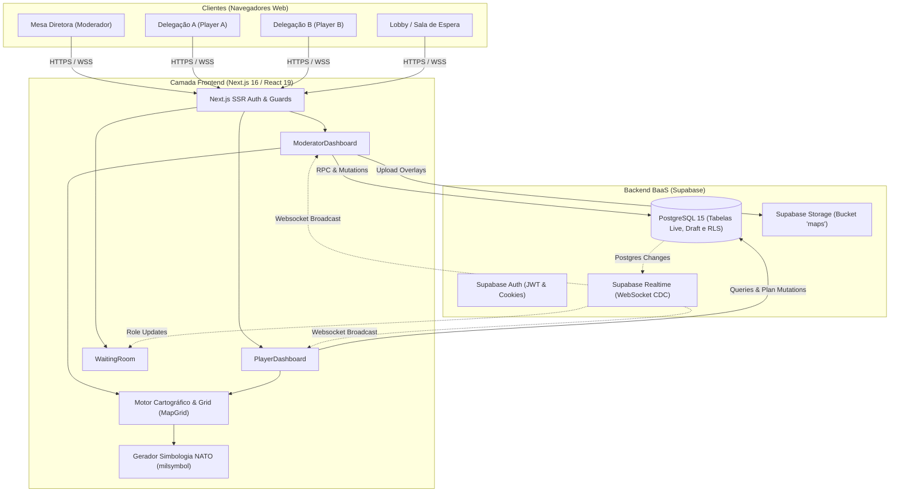
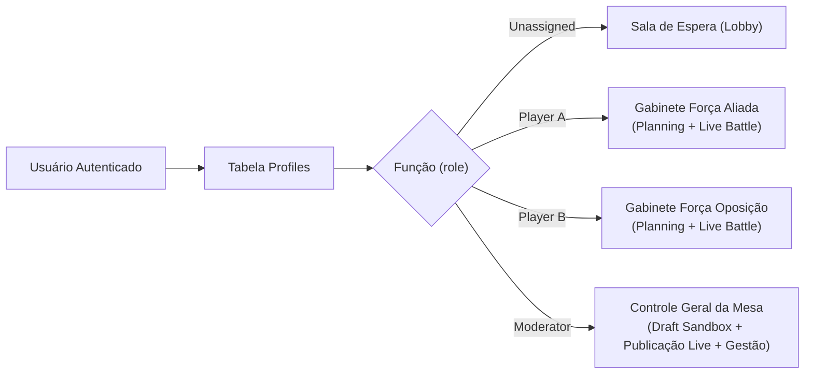
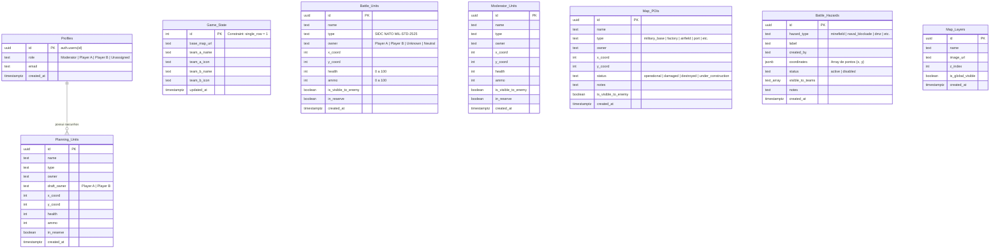
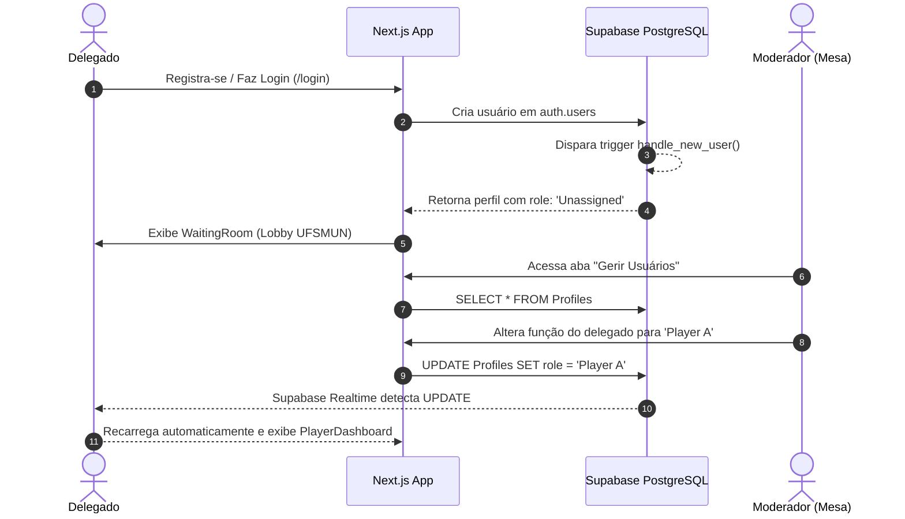
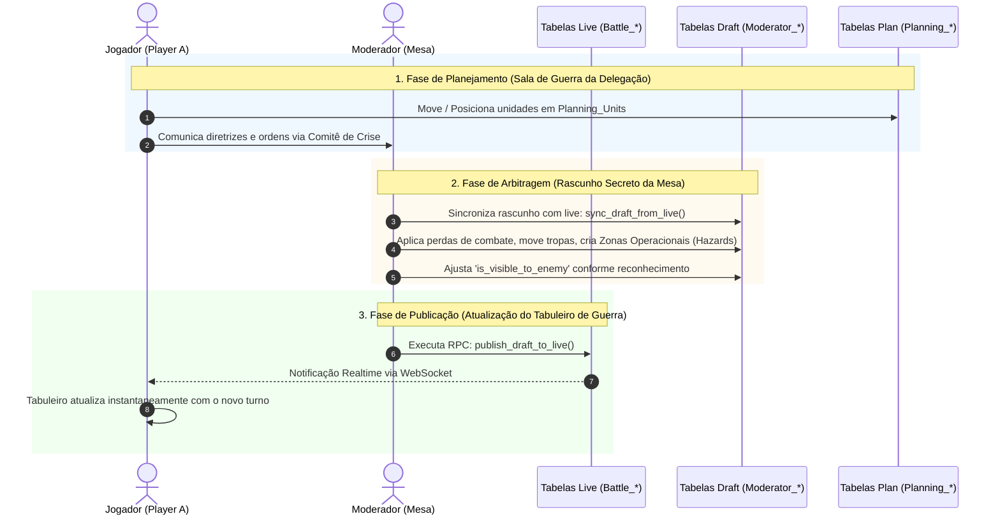

# Documento de Design e Arquitetura de Software (design.md)
## Projeto: Gabinete de Guerra UFSMUN (Wargame Tactical Simulator)

---

## 1. Visão Geral e Propósito

O **Gabinete de Guerra UFSMUN** é uma plataforma web interativa de simulação tática e operacional em tempo real, desenvolvida primariamente para apoiar Comitês de Crise em Simulações das Nações Unidas (UFSMUN — *Universidade Federal de Santa Maria Model United Nations*).

O sistema replica a dinâmica de uma sala de situação (*War Room*), onde delegações em conflito gerenciam suas ordens e forças armadas, enquanto a Mesa Diretora (Moderadores) atua como árbitro militar supremo, aplicando névoa de guerra (*Fog of War*), posicionando obstáculos geopolíticos/militares e validando turnos de combate.

### Principais Objetivos do Sistema
- **Névoa de Guerra & Inteligência Tática:** Jogadores só visualizam suas próprias tropas, posições inimigas previamente avistadas/confirmadas e setores desvelados pela Mesa Diretora.
- **Ambiente de Planejamento Isolado (*Sandbox*):** Cada delegação dispõe de um tabuleiro privado de planejamento onde rascunha estratégias antes de submeter ordens à mesa.
- **Rascunho e Publicação Atômica do Moderador:** Moderadores editam cenários complexos em ambiente de *Draft* e publicam alterações para o tabuleiro ao vivo (*Live Battle Table*) com execução transacional atômica.
- **Padronização Militar APP-6 / MIL-STD-2525:** Geração dinâmica de simbologia militar internacional via vetorização SVG para qualquer arma, escalão e afiliação de combate.
- **Cartografia Flexível:** Suporte a grid tático ortogonal com múltiplas camadas raster (mapas históricos, cartas topográficas, sobreposições de satélite), controle independente de opacidade e ordenação em profundidade (*z-index*).

---

## 2. Arquitetura de Alto Nível

A plataforma foi concebida sob uma arquitetura serverless orientada a eventos em tempo real, integrando **Next.js 16 (App Router)** no frontend com a suíte de serviços em nuvem do **Supabase (PostgreSQL 15+, Auth, Realtime e Storage)**.



### Componentes de Infraestrutura
1. **Next.js 16 (React 19, TypeScript):** Renderização híbrida com Server Components para validação de sessão no carregamento inicial ([`layout.tsx`](file:///c:/Users/vkunz/OneDrive/Documentos/Wargamming/wargame-client/src/app/layout.tsx) e [`page.tsx`](file:///c:/Users/vkunz/OneDrive/Documentos/Wargamming/wargame-client/src/app/page.tsx)) e Client Components reativos para a interface operacional.
2. **PostgreSQL com Row Level Security (RLS):** Garantia de isolamento estrito de visibilidade em nível de banco de dados, protegendo segredos operacionais de cada facção.
3. **Supabase Realtime (CDC - Change Data Capture):** Canal bidirecional WebSocket subscrito a mutações SQL (`INSERT`, `UPDATE`, `DELETE`), garantindo atualização instantânea do mapa sem polling.
4. **Supabase Storage:** Armazenamento de alta performance de ativos cartográficos em formato PNG/JPEG/WEBP servidos via CDN pública.

---

## 3. Modelo de Papéis e Segurança (RBAC & RLS)

O acesso às funcionalidades e à visualização de entidades do mapa é estritamente regulado por papéis salvos na tabela `Profiles`.



### Matriz de Permissões

| Entidade / Recurso | Moderador | Jogador (Player A / B) | Sala de Espera (Unassigned) |
| :--- | :--- | :--- | :--- |
| **Perfis (`Profiles`)** | Leitura total, Alteração de papéis | Leitura apenas do próprio perfil | Leitura apenas do próprio perfil |
| **Configuração (`Game_State`)** | Leitura e Edição (Nomes, Ícones, Mapa) | Apenas Leitura | Bloqueado |
| **Unidades ao Vivo (`Battle_Units`)** | Leitura/Escrita Irrestrita | Leitura de aliadas + inimigas visíveis (`is_visible_to_enemy = true`) | Bloqueado |
| **Unidades de Rascunho (`Moderator_Units`)** | Leitura/Escrita Total | Sem Acesso (RLS bloqueia) | Sem Acesso |
| **Unidades de Planejamento (`Planning_Units`)** | Acesso Total de Auditoria | Leitura/Escrita de planos da própria equipe | Bloqueado |
| **Pontos de Interesse (`Map_POIs`)** | Leitura/Escrita Total | Leitura de próprios + revelados | Bloqueado |
| **Zonas Operacionais (`Battle_Hazards`)** | Leitura/Escrita Total | Leitura se a equipe estiver em `visible_to_teams` | Bloqueado |
| **Camadas Customizadas (`Map_Layers`)** | Upload, reordenação e deleção | Leitura se `is_global_visible = true` | Bloqueado |

---

## 4. Modelagem de Dados (Entidades & Esquema)

O esquema relacional é estruturado para suportar o paradigma de **Draft vs. Live**: alterações do moderador são feitas em tabelas intermediárias (`Moderator_*`) e promovidas para as tabelas ao vivo (`Battle_*` / `Map_*`) através de procedimentos armazenados (RPCs).



### Funções Armazenadas Críticas (RPC)
- `publish_draft_to_live()`: Substitui atômica e transacionalmente o estado de `Battle_Units`, `Map_POIs` e `Battle_Hazards` pelos dados de `Moderator_Units`, `Moderator_POIs` e `Moderator_Hazards`.
- `sync_draft_from_live()`: Copia o estado atual da batalha ao vivo de volta para as tabelas de rascunho do moderador, permitindo edição incremental a partir do turno corrente.
- `handle_new_user()`: Disparado via trigger do Supabase Auth na criação de um usuário, inserindo automaticamente seu registro inicial na tabela `Profiles` com status `Unassigned`.

---

## 5. Subsistemas e Detalhamento de Componentes

### 5.1. Motor Cartográfico Tático ([`MapGrid.tsx`](file:///c:/Users/vkunz/OneDrive/Documentos/Wargamming/wargame-client/src/components/MapGrid.tsx))
O componente central de visualização e manipulação do cenário de guerra:
- **Grid Ortogonal:** Espaçamento padrão de célula de $40\text{px}$ (`CELL_SIZE = 40`), mapeando coordenadas inteiras `(x, y)` calculadas a partir de `getBoundingClientRect()` do contêiner.
- **Navegação com Pan & Zoom:** Desenvolvido sobre `react-zoom-pan-pinch`, suporta aproximação fluida, arrasto com botão do meio ou modo de navegação dedicado, e atalho de centralização tática.
- **Normalização de Escala de Marcadores (`ScaleUpdater`):** Injeta via CSS Variable (`--unit-inverse-scale`) a razão inversa do zoom para garantir que símbolos NATO e badges não fiquem excessivamente diminutos ou pixelizados quando o operador aproxima ou afasta o mapa.
- **Barra de Ferramentas HUD Superior:**
  - *Selecionar / Mover* (`select`): Seleciona alvos e arrasta fichas no grid.
  - *Arrastar Mapa* (`drag`): Deslocamento da câmera tática.
  - *Posicionar Unidade* (`place`): Inicia o modal de criação no ponto clicado.
  - *Desenhar Polígono / Zona* (`polygon`): Modo de desenho multiponto vetorial para delimitação de zonas de conflito.
  - *Ponto de Interesse* (`target`): Inicia a implantação de POI.
  - *Controles de Visibilidade & Opacidade*: Ajuste fino em tempo real de cada camada gráfica e grid.

### 5.2. Motor de Simbologia Militar NATO ([`NatoSymbol.tsx`](file:///c:/Users/vkunz/OneDrive/Documentos/Wargamming/wargame-client/src/components/NatoSymbol.tsx) & [`utils.ts`](file:///c:/Users/vkunz/OneDrive/Documentos/Wargamming/wargame-client/src/lib/milsymbol/utils.ts))
Implementa o padrão internacional **NATO APP-6 / MIL-STD-2525**:
- **Composição SIDC (15 caracteres):**
  - Caractere 2: Afiliação (`F` = Aliado/Friend, `H` = Inimigo/Hostile, `N` = Neutro, `U` = Desconhecido).
  - Caractere 3: Dimensão do Teatro (`G` = Terrestre, `A` = Aéreo, `S` = Superfície Marítima, `U` = Submarino).
  - Caracteres 5–10: Código da Função (Infantaria, Blindados, Artilharia, Guerra Eletrônica, Forças Especiais, etc.).
  - Caractere 12: Escalão Tático (Pelotão, Companhia, Batalhão, Brigada, Divisão).
- **Adequação de Cores e Alto Contraste:** Mapeia os quadros militares tradicionais para as cores semânticas customizadas do Gabinete de Guerra UFSMUN (Aliado em Verde Petróleo `#2d7d74`, Oposição em Ameixa Escura `#4e1a3d`, Incógnito em Amarelo Ocre `#d4a017`).
- **Renderização Otimizada:** As instâncias de símbolos SVG são compiladas em Base64 Data URLs e memoizadas via `useMemo` para evitar repinturas custosas da árvore DOM durante movimentações no mapa.

### 5.3. Pontos Estratégicos e Infraestrutura ([`PoiBadge.tsx`](file:///c:/Users/vkunz/OneDrive/Documentos/Wargamming/wargame-client/src/components/PoiBadge.tsx))
Diferente da simbologia de unidades móveis, os Pontos de Interesse (POIs) utilizam iconografia moderna da biblioteca `lucide-react`, combinando reconhecimento instantâneo com estados visuais:
- **Tipos Suportados:** Base Militar (`Shield`), Quartel-General (`Building2`), Fábrica (`Factory`), Ponte (`MoveHorizontal`), Aeródromo (`Plane`), Bunker (`ShieldAlert`), Posto de Controle (`MapPin`), Depósito Logístico (`Warehouse`), Porto (`Anchor`), Radar (`Radar`), Posto Avançado (`Flag`).
- **Estados Operacionais:**
  - *Operacional:* Borda sólida e cor viva da facção controladora.
  - *Danificado:* Borda tracejada âmbar e opacidade atenuada.
  - *Destruído:* Escala de cinza com sobreposição de glifo de advertência vermelho (`X`).
  - *Em Construção:* Borda pontilhada.

### 5.4. Zonas Operacionais e Riscos ([`HazardCreationModal.tsx`](file:///c:/Users/vkunz/OneDrive/Documentos/Wargamming/wargame-client/src/components/HazardCreationModal.tsx) & [`HazardPanel.tsx`](file:///c:/Users/vkunz/OneDrive/Documentos/Wargamming/wargame-client/src/components/HazardPanel.tsx))
Permite o desenho de geometrias poligonais sobre a malha de batalha para representar fenômenos de terreno, barreiras de engenharia ou ataques indiretos:
- **Tipos de Zonas:** Campo Minado, Bloqueio Naval, Zona Inundada, Zona Desmilitarizada (DMZ), Trincheiras, Barragem de Artilharia, Contaminação Química/NRBQ, Cortina de Fumaça e Zona de Influência.
- **Névoa de Guerra Granular:** O moderador seleciona no modal quais equipes têm inteligência visual sobre a zona através do vetor `visible_to_teams` (`['Moderator', 'Player A']`).

### 5.5. Gerenciamento de Camadas Cartográficas ([`LayerManager.tsx`](file:///c:/Users/vkunz/OneDrive/Documentos/Wargamming/wargame-client/src/components/LayerManager.tsx))
- **Upload e Persistência:** Envio de arquivos de imagem diretamente para o bucket `maps` do Supabase Storage com geração de URLs públicas permanentes.
- **Ordenação em Profundidade (*Z-Index*):** Reordenação interativa via botões subir/descer e drag-and-drop com persistência no banco e no `localStorage`.
- **Controle de Transparência:** Ajuste de opacidade independente para mesclagem de cartas topográficas com a grade tática e o mapa-base.

### 5.6. Gestão de Reservas e Prontidão Logística ([`ReservesPanel.tsx`](file:///c:/Users/vkunz/OneDrive/Documentos/Wargamming/wargame-client/src/components/ReservesPanel.tsx))
- Separação entre unidades ativas no tabuleiro e unidades em reserva estratégica (`in_reserve = true`).
- Acompanhamento de integridade de combate: Saúde (`health`, $0\text{--}100\%$) e Prontidão de Munição (`ammo`, $0\text{--}100\%$).
- Atalho rápido de duplicação (`Ctrl+C` ou botão) para escalonamento rápido de reforços diretamente na bandeja de reservas.

### 5.7. Gestão de Equipes e Sala de Espera ([`TeamAssignment.tsx`](file:///c:/Users/vkunz/OneDrive/Documentos/Wargamming/wargame-client/src/components/TeamAssignment.tsx) & [`WaitingRoom.tsx`](file:///c:/Users/vkunz/OneDrive/Documentos/Wargamming/wargame-client/src/components/WaitingRoom.tsx))
- Novos delegados aguardam no lobby temático da UFSMUN com sincronização simulada e escuta em tempo real da tabela `Profiles`.
- Moderadores podem customizar em tempo de execução os nomes e insígnias das forças em combate na tabela `Game_State` (ex.: trocar "Força Aliada" para "Federação do Norte").
- Promoção ou remanejamento de jogadores com recarregamento reativo instantâneo na ponta do cliente.

---

## 6. Identidade Visual e Design System

O design de interface do projeto foi estruturado a partir de tokens semânticos no [`globals.css`](file:///c:/Users/vkunz/OneDrive/Documentos/Wargamming/wargame-client/src/app/globals.css) (compatível com Tailwind CSS v4), adotando a estética sóbria e funcional de uma sala de comando militar internacional:

### Paleta Cromática Temática
- **Canvas Void (`--color-surface-canvas-void`):** `#1f2420` — Fundo ultra-escuro esverdeado que reduz o cansaço visual e simula monitores de comando tático.
- **Verde Comando Primário (`--color-primary` / `--color-primary-container`):** `#00322b` / `#004b41` — Cor institucional das barras superiores e modais operacionais.
- **Pergaminho Tático (`--color-surface-parchment`):** `#f7f4eb` — Utilizado nos painéis flutuantes, gavetas de dossiê e modais de criação para emular mapas e relatórios impressos.
- **Força A / Aliado (`--color-faction-friendly`):** `#2d7d74` (com destaque `#a4f1e5`).
- **Força B / Oposição (`--color-faction-hostile`):** `#4e1a3d` (com destaque `#c03a6b`).
- **Neutro / Ativo Cívico (`--color-faction-neutral`):** `#26265b`.
- **Incógnito / Não Confirmado (`--color-faction-unknown`):** `#d4a017`.
- **Alerta e Degradação:** `#ef4444` (Crítico/Mina), `#e07a2f` (Degradado/Alerta).

### Tipografia
- **Títulos e Identificadores Operacionais:** `Montserrat` (`--font-montserrat`), conferindo aspecto institucional, militar e autoritativo.
- **Corpo de Texto e Dados Técnicos:** `Karla` (`--font-karla`), proporcionando excelente legibilidade para coordenadas, tabelas de prontidão e notas táticas.
- **Ícones do Sistema:** Google `Material Symbols Outlined` integrados para navegação global e `Lucide React` para simbologia cartográfica de infraestrutura.

### Ergonomia e Painéis Dinâmicos
- **Painéis Redimensionáveis ([`useResizablePanel.ts`](file:///c:/Users/vkunz/OneDrive/Documentos/Wargamming/wargame-client/src/hooks/useResizablePanel.ts)):** As barras laterais esquerda (camadas e filtros) e direita (dossiê de inteligência e edição) possuem redimensionamento horizontal interativo com persistência automática de largura no `localStorage`.
- **Gaveta Inferior Mobile ([`BottomNavbar.tsx`](file:///c:/Users/vkunz/OneDrive/Documentos/Wargamming/wargame-client/src/components/BottomNavbar.tsx)):** Em dispositivos móveis ou tablets, as barras laterais colapsam em uma barra de ferramentas inferior tática, permitindo alternar rapidamente entre visualização do mapa, lista de tropas e camadas.

---

## 7. Fluxos de Operação e Ciclo de Vida da Batalha

### 7.1. Fluxo de Ingresso e Atribuição de Forças


### 7.2. Ciclo de Arbitragem do Turno (Planejamento $\rightarrow$ Resolução $\rightarrow$ Publicação)


---

## 8. Segurança, Concorrência e Integridade de Dados

1. **Garantia de Névoa de Guerra por RLS:**
   - Em nenhuma circunstância o cliente de um jogador recebe unidades inimigas ocultas através de queries GraphQL ou REST, pois as políticas RLS filtram os registros diretamente no motor do PostgreSQL:
   ```sql
   CREATE POLICY "Player read access on Battle_Units" 
   ON public."Battle_Units" FOR SELECT 
   USING ( owner = public.get_user_role() OR is_visible_to_enemy = TRUE );
   ```
2. **Prevenção de Duplicações Concorrentes:**
   - No cliente, travas de concorrência (`isDuplicatingRef.current = true`) impedem que múltiplos cliques repetidos ou atalhos de teclado criem duplicatas indesejadas antes da resolução da Promise no banco.
3. **Persistência de Sessão Segura:**
   - O cliente de servidor ([`supabaseServer.ts`](file:///c:/Users/vkunz/OneDrive/Documentos/Wargamming/wargame-client/src/lib/supabaseServer.ts)) utiliza cookies seguros criptografados via `@supabase/ssr`, garantindo conformidade com SSR e protegendo os tokens JWT contra ataques XSS.

---

## 9. Guia de Arquivos e Estrutura do Código

```text
Wargamming/
├── design.md                          # Este documento de arquitetura
├── wargame-client/
│   ├── src/
│   │   ├── app/
│   │   │   ├── auth/callback/route.ts # Callback OAuth / Supabase Auth
│   │   │   ├── login/page.tsx         # Página de login operacional
│   │   │   ├── register/page.tsx      # Cadastro de novos delegados
│   │   │   ├── globals.css            # Design tokens, tema e utilitários Tailwind v4
│   │   │   ├── layout.tsx             # Root Layout (metadados e fontes Montserrat/Karla)
│   │   │   └── page.tsx               # Roteamento condicional baseado em perfil/role
│   │   ├── components/
│   │   │   ├── ui/                    # Primitivas de interface (TopBar, Panel)
│   │   │   ├── BottomNavbar.tsx       # Barra de navegação tática para mobile
│   │   │   ├── HazardCreationModal.tsx# Modal de parametrização de polígonos/zonas
│   │   │   ├── HazardPanel.tsx        # Inspetor e editor de zonas operacionais
│   │   │   ├── LayerManager.tsx       # Gerenciador de camadas raster e upload de mapas
│   │   │   ├── MapGrid.tsx            # Motor cartográfico, grid e viewport pan/zoom
│   │   │   ├── ModeratorDashboard.tsx # Painel completo da Mesa Diretora
│   │   │   ├── NatoSymbol.tsx         # Componente gerador de símbolos MIL-STD-2525
│   │   │   ├── PlayerDashboard.tsx    # Painel dos Jogadores (Planejamento e Batalha)
│   │   │   ├── PoiBadge.tsx           # Insígnia gráfica para infraestrutura/POIs
│   │   │   ├── PoiCreationModal.tsx   # Modal de criação de pontos estratégicos
│   │   │   ├── PoiPanel.tsx           # Inspetor e editor de POIs
│   │   │   ├── ReservesPanel.tsx      # Gaveta de unidades em reserva estratégica
│   │   │   ├── RightPanelDossier.tsx  # Dossiê de inteligência da unidade selecionada
│   │   │   ├── Sidebar.tsx            # Barra lateral de controle de camadas e filtros
│   │   │   ├── TeamAssignment.tsx     # Gerenciamento de delegações e nomes de facções
│   │   │   ├── UnitCreationModal.tsx  # Modal de criação de unidades militares
│   │   │   ├── UnitPanel.tsx          # Roster e editor de atributos militares
│   │   │   └── WaitingRoom.tsx        # Sala de espera do Comitê de Crise UFSMUN
│   │   ├── hooks/
│   │   │   └── useResizablePanel.ts   # Hook para painéis com largura redimensionável
│   │   ├── lib/
│   │   │   ├── milsymbol/             # Utilitários de codificação SIDC e tabelas NATO
│   │   │   ├── supabaseClient.ts      # Cliente Supabase singleton para o browser
│   │   │   └── supabaseServer.ts      # Instância segura do Supabase para SSR
│   │   └── data/
│   │       └── mapConfig.json         # Configuração geométrica do mapa e estradas
│   ├── supabase/
│   │   ├── supabase_schema.sql        # Esquema inicial DDL e funções principais
│   │   ├── supabase_rls_policies.sql  # Políticas completas de Row Level Security
│   │   ├── supabase_moderator_draft.sql# Tabelas de rascunho e RPCs de publicação
│   │   ├── supabase_add_fuel_ammo.sql # Migração de integridade logística (munição)
│   │   └── supabase_storage.sql       # Configuração de buckets e permissões de storage
│   ├── package.json                   # Dependências e scripts do projeto
│   └── tsconfig.json                  # Configuração TypeScript
```

---

## 10. Diretrizes de Evolução e Roadmap Técnico

1. **Ferramenta de Setas de Manobra e Linhas de Fase:** Implementação completa da ferramenta `arrow` do HUD para desenhar eixos de progressão e limites de setor tático diretamente sobre o mapa em SVG vetorial.
2. **Replay e Histórico de Turnos:** Gravação de snapshots de cada turno publicado para permitir reprodução (*playback*) da evolução da crise em assembleia geral do comitê.
3. **Módulo de Resolução Automatizada de Combate:** Assistente com dados de tabelas de atrito calculando probabilidades com base no tipo de força e terreno antes da validação final do moderador.
4. **Exportação de Relatórios de Situação (SITREP):** Geração de resumos em PDF com a imagem do teatro operacional e lista de perdas/conquistas ao final de cada sessão da simulação.
